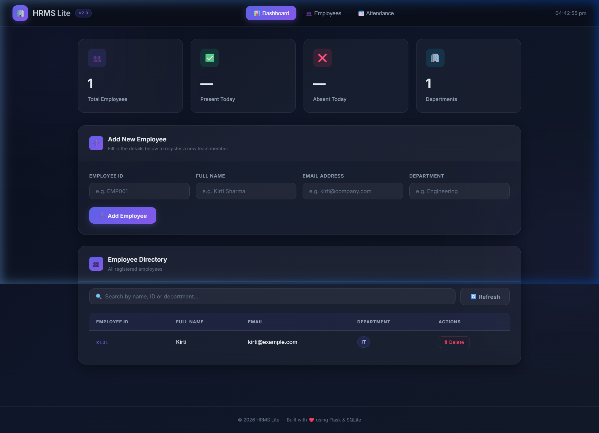
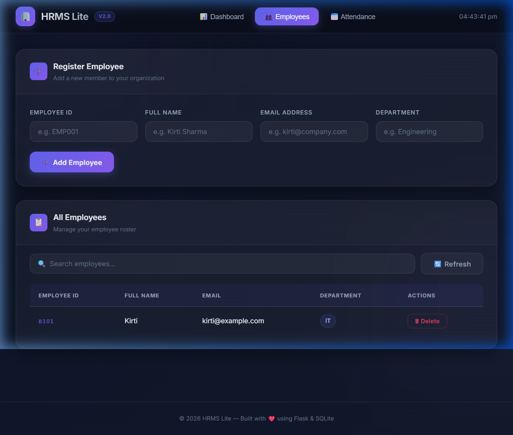
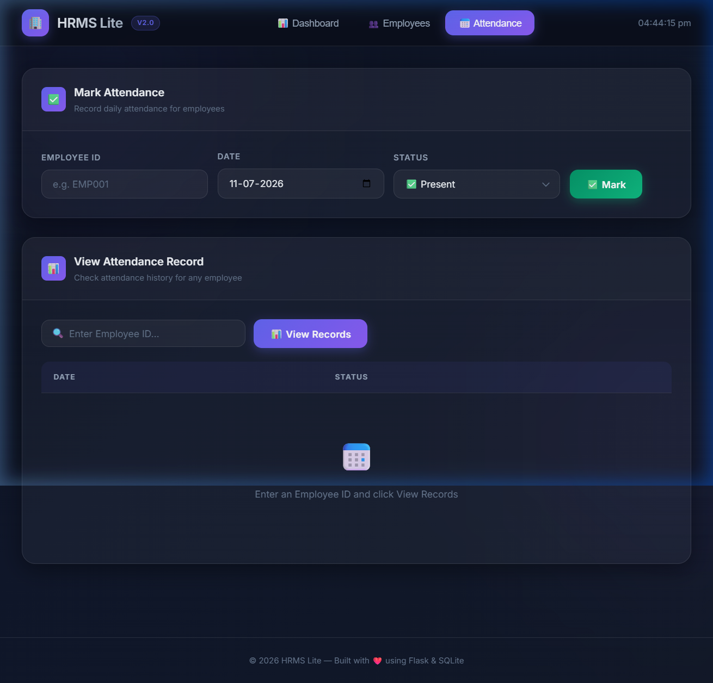

<div align="center">

# 🏢 HRMS Lite

**A modern, lightweight Human Resource Management System**

[](https://hrms-lite-1-lc1j.onrender.com)
[](https://python.org)
[](https://flask.palletsprojects.com)
[](https://sqlite.org)

*Manage your team effortlessly — employees, attendance, and analytics all in one beautiful dashboard.*

</div>

---

## ✨ Features

| Feature | Description |
|--------|-------------|
| 👥 **Employee Management** | Add, view, search, and remove employees with full details |
| 📅 **Attendance Tracking** | Mark daily attendance (Present / Absent) with date picker |
| 📊 **Live Dashboard** | Real-time stats — total employees, departments, attendance summary |
| 🔍 **Smart Search** | Instant client-side filtering by name, ID, or department |
| 🎨 **Premium Dark UI** | Glassmorphism design with indigo/purple accents and smooth animations |
| 🔔 **Toast Notifications** | Elegant toast alerts replace disruptive browser popups |
| ⏰ **Live Clock** | Real-time clock in the header bar |
| 📱 **Fully Responsive** | Mobile-friendly layout for all screen sizes |
| ✅ **Input Validation** | Server-side email format and duplicate ID checks |

---

## 📸 Screenshots

### 📊 Dashboard


### 👥 Employee Directory


### 📅 Attendance Tracking


---

## 🛠 Tech Stack

```
Frontend   →  HTML5 · Vanilla CSS (Glassmorphism) · JavaScript (ES6+)
Backend    →  Python · Flask · Flask-SQLAlchemy
Database   →  SQLite (via SQLAlchemy ORM)
Hosting    →  Render (Free Tier)
Fonts      →  Google Fonts — Inter
```

---

## 🚀 Quick Start (Local)

### Prerequisites
- Python 3.8+
- pip

### Installation

```bash
# 1. Clone the repository
git clone https://github.com/kirti2006/hrms-lite.git
cd hrms-lite

# 2. Install dependencies
pip install -r requirements.txt

# 3. Run the application
python app.py

# 4. Open in your browser
#    http://127.0.0.1:5000/
```

---

## 📡 API Reference

| Method | Endpoint | Description |
|--------|----------|-------------|
| `GET` | `/api/employees` | List all employees |
| `POST` | `/api/employees` | Add a new employee |
| `DELETE` | `/api/employees/<emp_id>` | Remove an employee |
| `POST` | `/api/attendance` | Mark attendance |
| `GET` | `/api/attendance/<emp_id>` | Get attendance records |

### Example — Add Employee
```json
POST /api/employees
{
  "emp_id": "EMP001",
  "name": "Kirti Sharma",
  "email": "kirti@company.com",
  "department": "Engineering"
}
```

### Example — Mark Attendance
```json
POST /api/attendance
{
  "emp_id": "EMP001",
  "date": "2026-07-11",
  "status": "Present"
}
```

---

## 📁 Project Structure

```
hrms-lite/
├── app.py                  # Flask application & API routes
├── requirements.txt        # Python dependencies
├── templates/
│   └── index.html          # Main UI (tabbed SPA)
├── static/
│   └── style.css           # Premium glassmorphism theme
├── screenshots/
│   ├── dashboard.png
│   ├── employees.png
│   └── attendance.png
└── instance/
    └── hrms.db             # SQLite database (auto-created)
```

---

## ☁️ Deployment (Render)

This app is deployed on [Render](https://render.com):

1. Connect your GitHub repo to Render
2. Set **Build Command**: `pip install -r requirements.txt`
3. Set **Start Command**: `gunicorn app:app`
4. Deploy — Render auto-deploys on every push to `main`

**Live at:** [https://hrms-lite-1-lc1j.onrender.com](https://hrms-lite-1-lc1j.onrender.com)

---

<div align="center">
  Made with ❤️ by <a href="https://github.com/kirti2006">Kirti</a> · Powered by Flask & SQLite
</div>
